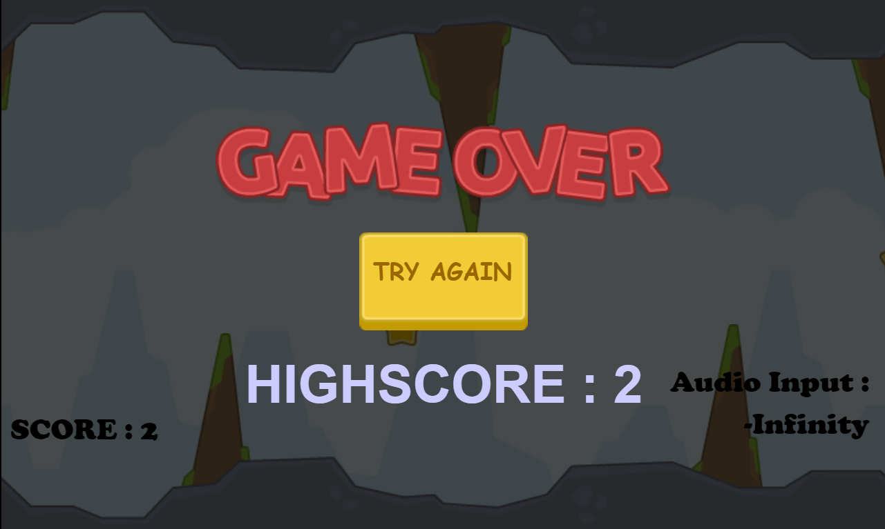

# Permainan Multimedia Sederhana Berbasis Web

Permainan ini dibangun menggunakan Construct 2, dapat menggunakan kontrol suara dan klik / tap.

## Antarmuka aplikasi




## Credit

> 1. Assets by [kenney.nl](kenney.nl)
> 2. Inspired by [redfoc.com](redfoc.com)

# Tutorial pembuatan game original

> 1. [Part 1](https://www.youtube.com/watch?v=w1xE3IXdL9g)
> 2. [Part 2](https://www.youtube.com/watch?v=R_h86vryYSs)

## Disclaimer

> Aplikasi ini hanya sebatas tugas kuliah saya.

## Requirement

> npm v6.14.6

## Prerequisite

> 1. Familiar dengan command prompt / terminal.
> 2. Mengerti cara melakukan clone project / download zip source code dari Github.

## Instalasi

Ada dua cara instalasi yang saya uraikan, silakan gunakan cara yang dirasa nyaman dan familiar. Bagi yang terbiasa dengan perintah git, silakan gunakan [cara pertama](#instalasi-dengan-cara-clone-git-repository). Jika tidak familiar dengan git, bisa gunakan [cara kedua](#instalasi-dengan-cara-download-zip).

### Instalasi dengan cara clone git repository

1. Pada command prompt / terminal, eksekusi perintah berikut ini :

```
git clone git@github.com:DonzTea/improved-tappy-plane-with-voice-control.git
```

2.  Masuk ke folder yang telah di-clone tersebut dengan perintah :

```
cd improved-tappy-plane-with-voice-control
```

1.  Install library web server http-server dengan perintah:

```
npm install
```

### Instalasi dengan cara download zip

1. Download source code dalam bentuk zip dengan cara klik tombol code, kemudian klik download zip seperti gambar di bawah ini.

<p align="center">
  
</p>

2. Extract file zip yang telah didownload.
3. Buka command prompt / terminal, masuk ke direktori dimana folder yang telah diextract tadi berada.
4. Install library web server http-server dengan perintah:

```
npm install
```

## Menjalankan aplikasi

1.  Start local server menggunakan command `npm run start`.
2.  Buka browser, kemudian akses `http://localhost:8080`.

## Tutorial permainan

1. Jika kamu ingin menggunakan kontrol suara, aktifkan dulu microphone pada localhost. Klik tombol info, kemudian pada bagian microphone pilih allow setelah itu. Jika kamu ingin menggunakan kontrol klik / tap saja, silakan pilih block kemudian refresh tab.

<p align="center">
  
</p>

2. Jika menggunakan perintah suara ucapkan nama dari kapal yang ingin digunakan, jika tidak cukup klik kapal.


3. Kamu akan diberikan waktu persiapan selama 3 detik.


4. Kumpulkan bintang sebanyak mungkin dan jangan sampai menabrak benda lain. Kamu bisa menggunakan kontrol suara maupun klik / tap. Jika menggunakan kontrol suara, ingat bahwa naik turunnya kapal ditentukan dari tinggi rendahnya suara bukan dari seberapa kerasnya.


5. Saat kapalmu menabrak benda lain permainan akan selesai. Jika kamu menggunakan kontrol suara kamu bisa bermain lagi dengan cara mengatakan "Try Again", jika tidak cukup klik tombol "Try Again".


